# miniRT
***My first RayTracer - 21 school project***

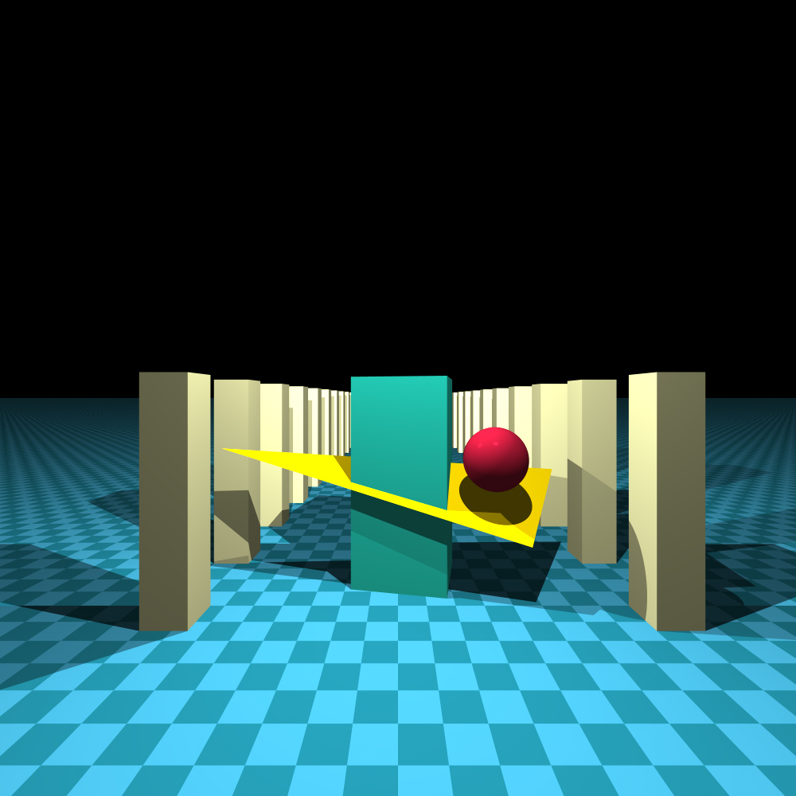

## Description
The goal of this project is to generate images
using the _Raytracing protocol_. Those computer
generated images will each represent a scene, as
seen from a specific angle and position, defined
by simple geometric objects, and each with its own
lighting system.<br/>
This project requires Minilibx library to work.

#### Installation:
```bash
    git clone https://github.com/sashly/miniRT.git miniRT
    cd ./miniRT
    make bonus
```
#### Starting the program:
```bash
    ./miniRT <scene_name.rt>         [1]
    ./miniRT <scene_name.rt> --save  [2]
    [1] - interactive mod
    [2] - only save screenshort mod 
```
#### Example:
```bash
    ./miniRT ./scenes/def28_planets.rt
```
#### Keys:
* `WASD` - move forward, left, back, right
* `QE` - move up, down
* `arrow keys` - rotate camera
* `+-` - camera zoom
* `c` - change camera
* `p` - create screenshort
* `1` - map of normals mod
* `2` - color filter off
* `3` - grayscale color filter
* `4` - sepia color filter
* `5` - RGB color filter
* `6` - anti-aliasing off
* `7` - anti-aliasing 4x
* `8` - anti-aliasing 9x
* `9` - anti-aliasing 16x
* `0` - anti-aliasing 25x
* `TRFGHY` - objects translation
* `IUJKLO` - objects rotations
* `<>` - change the current object
* `esc` - quite the program

## Object primitives
* sphere
* plane
* cylinder
* square
* triangle
* ellipsoid
* cone
* rectangle
* disk
* box
* pyramid
* aabb (axis-aligned bounding box)

## Features Implemented
* Normal disruption e.g. using sine which gives a wave effect.
* Color disruption: checkerboard (3D and 2D for sphere).
* Normal maps.
* Parallel light following a precise direction.
* Color filters (grayscale, sepia, RGB).
* Super-sampling (anti-aliasing).
* Multithreaded rendering.
* Texturing: uv mapping (sphere and square).
* Bump and normal mapping.
* Skybox.
* Keyboard interactivity (translation/rotation) with camera.
* Keyboard interactivity (translation/rotation) with objects.
* Simple .obj files loader.
* Smooth triangles.

## Screenshots
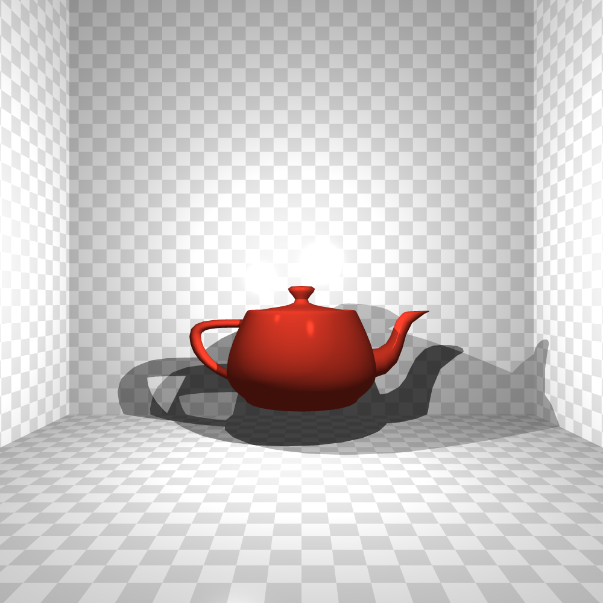
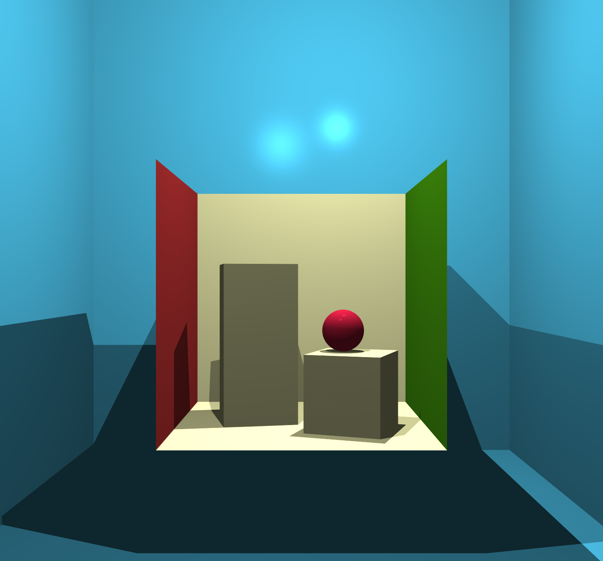
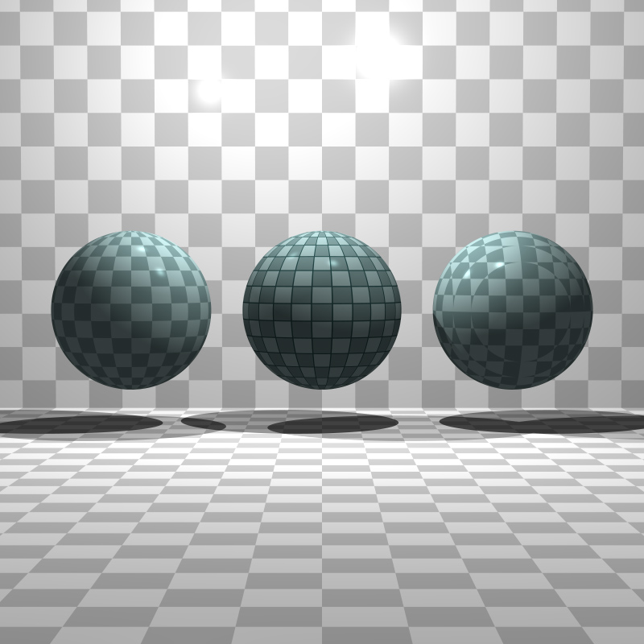
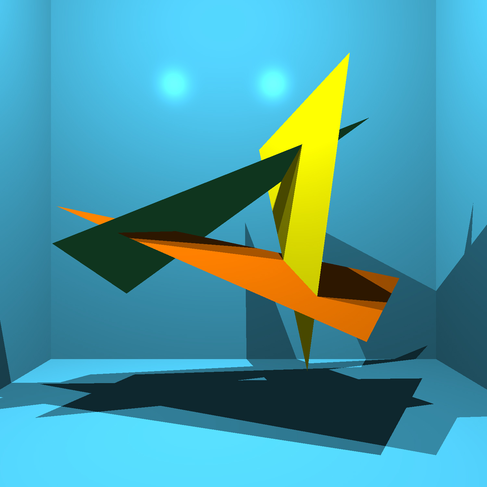
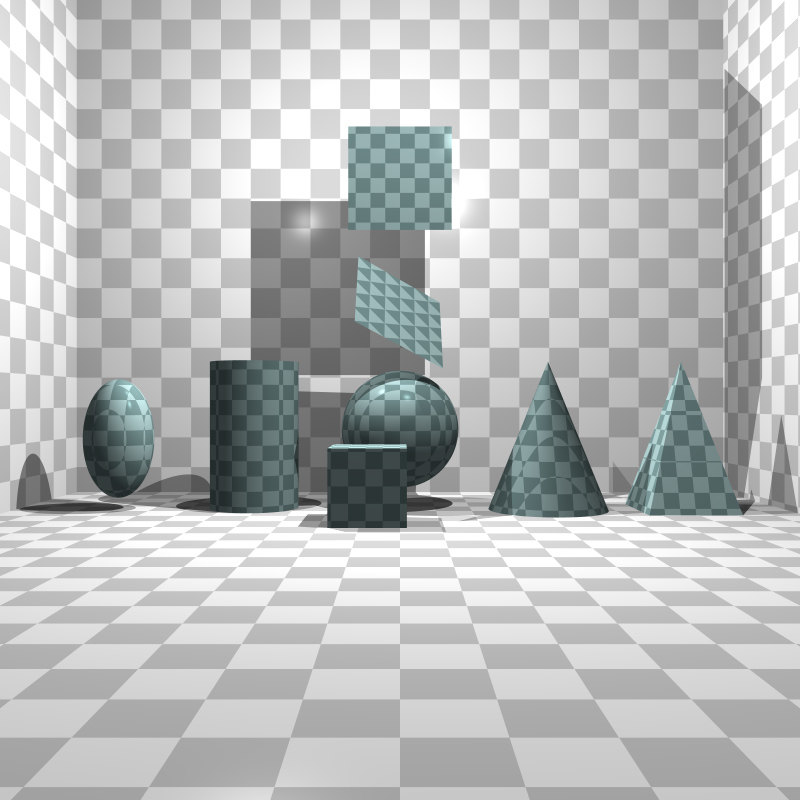
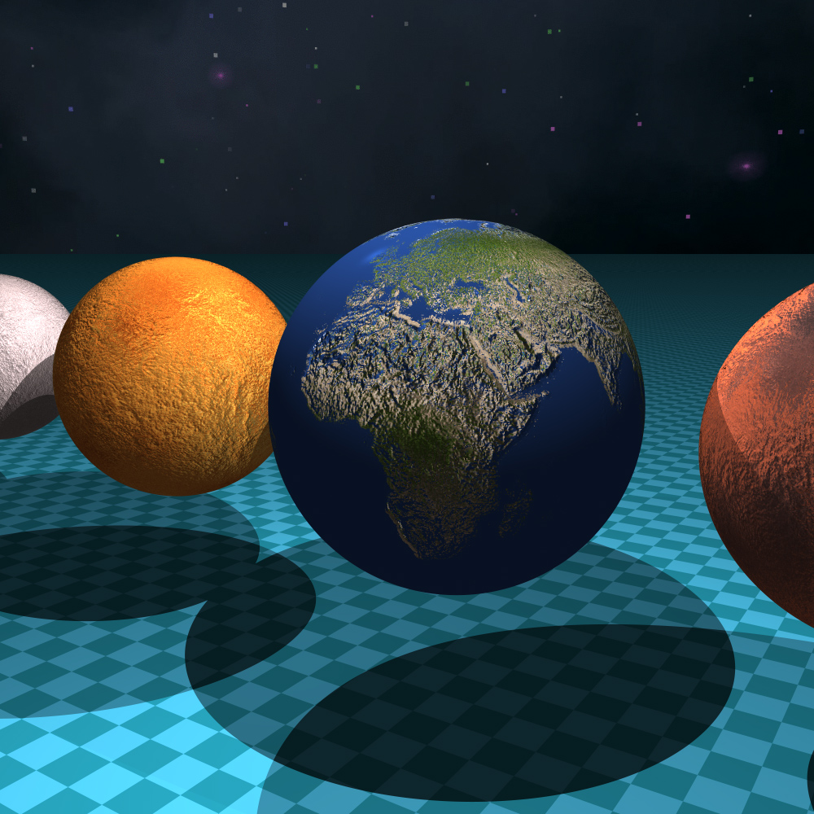
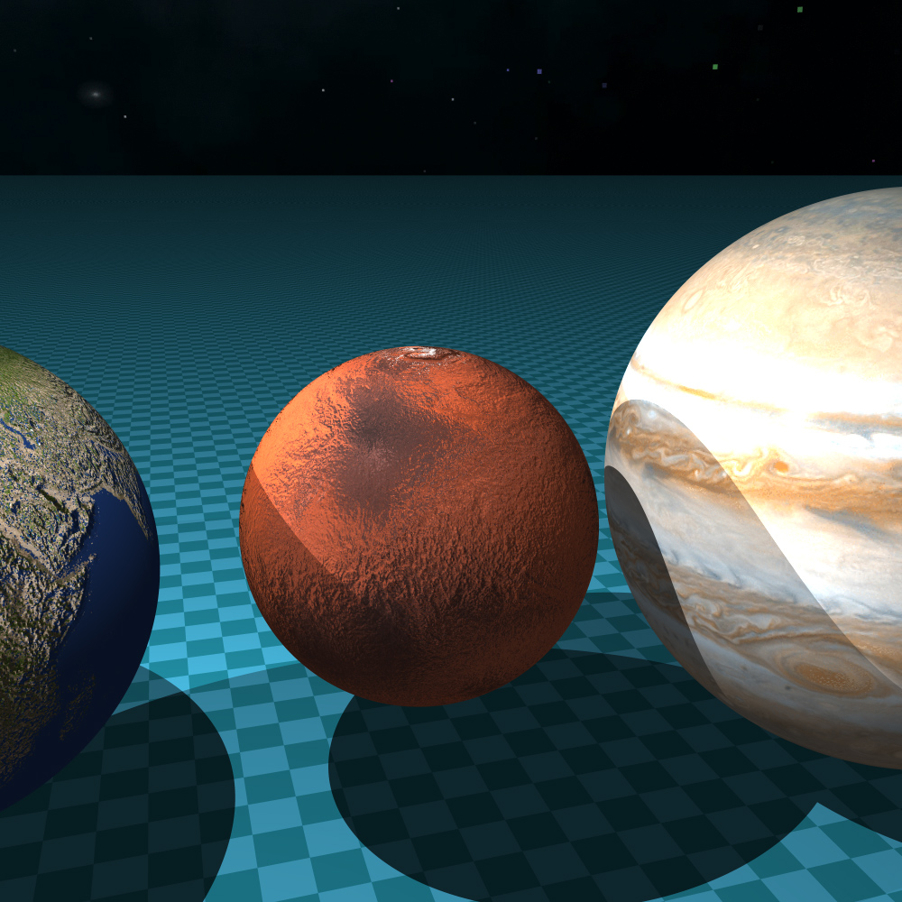
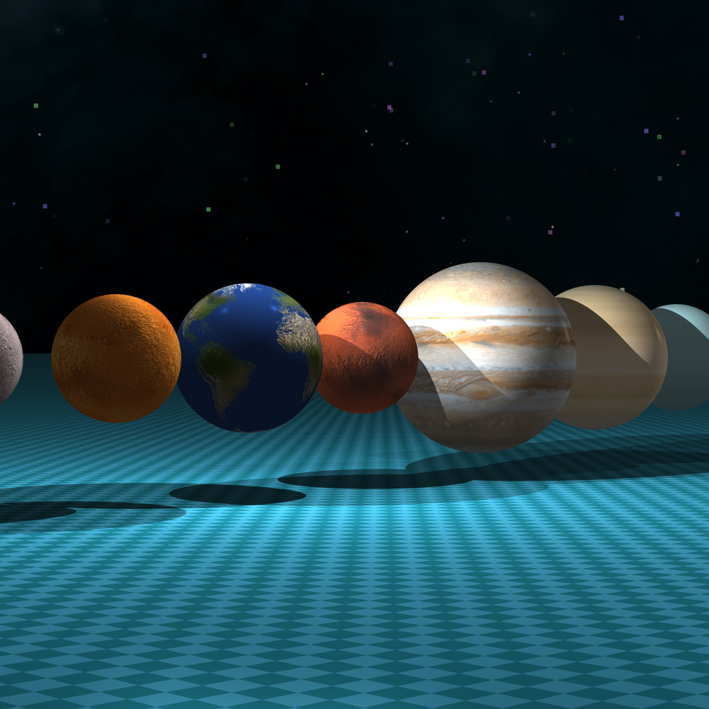
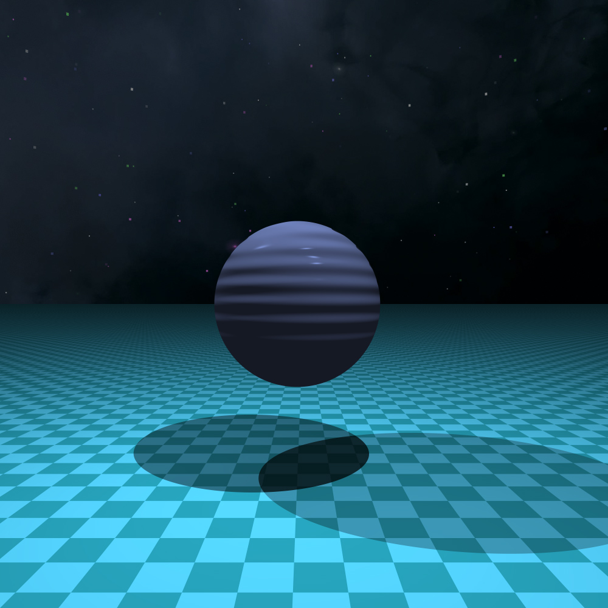
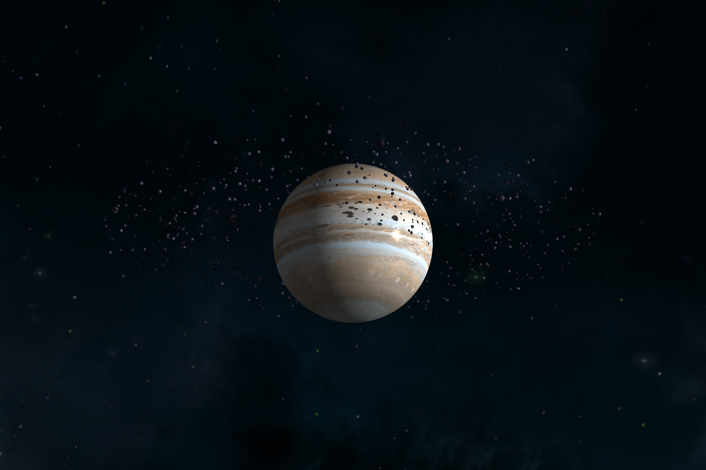
